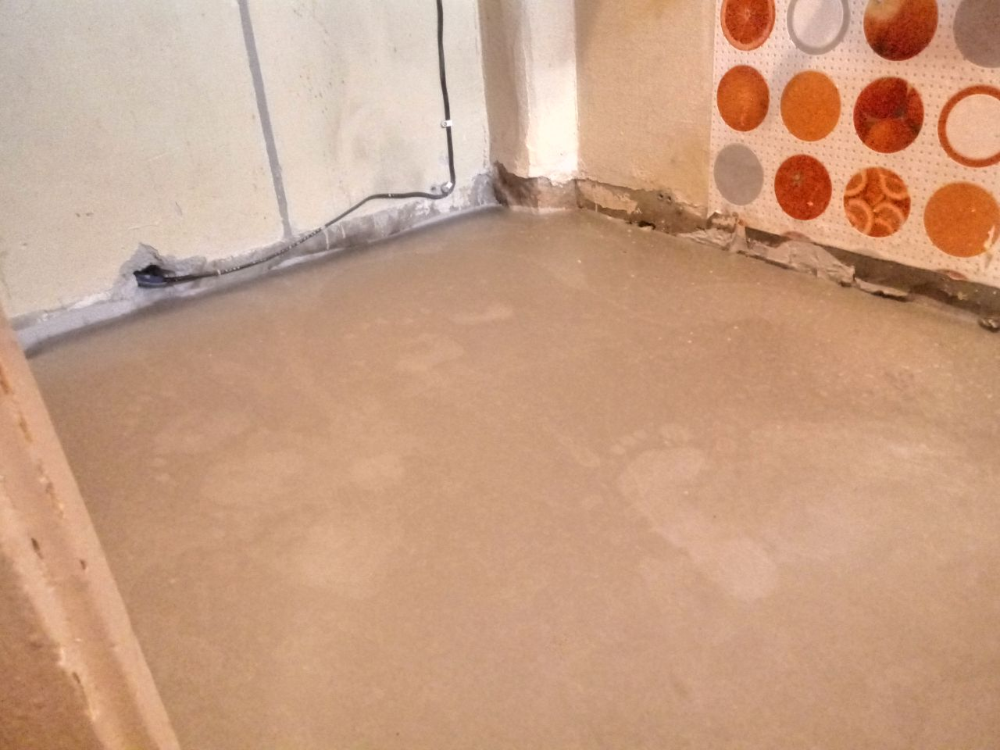
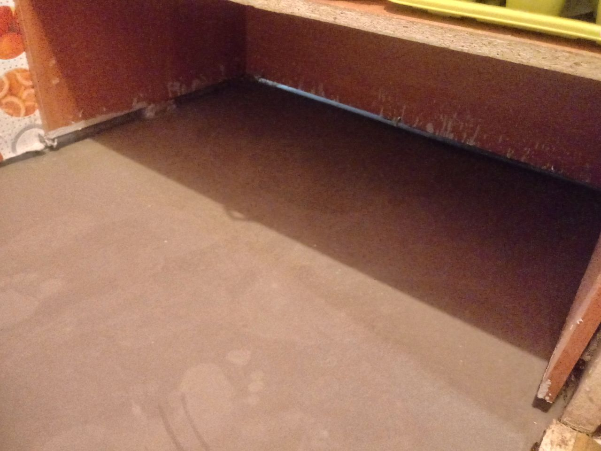

# работа день 2

Залили пол в два этапа. С начала залили 3 мешка, потом перерыв на подсыхание 2-а часа, потом залили ещё два, На работу в среднем ушло 5 часов.

**Выводы**: один мешок оказался лишним \(лучше больше чем меньше\). Очень помогла плёнка, иначе бы всё загадили, а вод ведро на 20 л. на мешок в 25 кг прямо в притык. По заливки: думаю лучше был бы вариант, это мешать и заливать за раз мешок, так бы выходило быстрее и всю поверхность за раз накрывал новый слой. А так пришлось мешать по пол мешка.

*  
*  
*  
*  
*  

По плану на следующих выходных завершить работу с полом, переместить стиральную машину, и всё собрать на кухне как было раньше.

