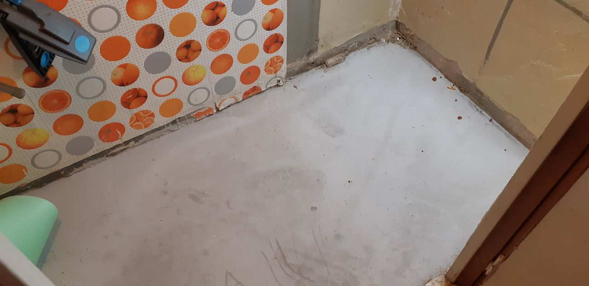

# работа день 3

Для резки ламината использовал лобзик, при этом не использовал защитные очки, **стружка часто залетала в глаза,** на будущее обязательно использовать защитные очки**.**

Во время укладки не хватило лимината, т.к. я расчитывал по площади, без учёта обрезков, пришлось ехать в магазин и докупать ещё упаковку. Также я не подумал о плинтусах и креплениях плинтусов, то же пришлось покупать.

Фото отчёт:

**Суббота**, начал укладку подложки.

*  
*  
*  

Тут понял что нужно всё таки убирать стол, т.к не смогу уложить ламинат

*  
*  

Продолжит укладку, уже с новой подложкой, старую выбросил

*  

Тут кончился ламинат, пришлось ехать в магаз

*  

Это после укладки и установки плинтуса и стола.

*  

**Воскресенье**, поставил стиралку

*  
*  

Переместил остатки барахлишка.

*  

