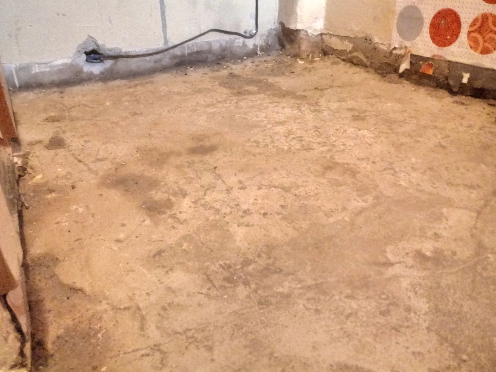
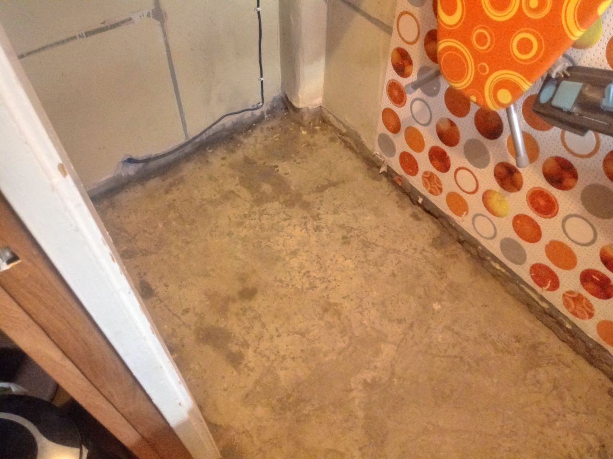
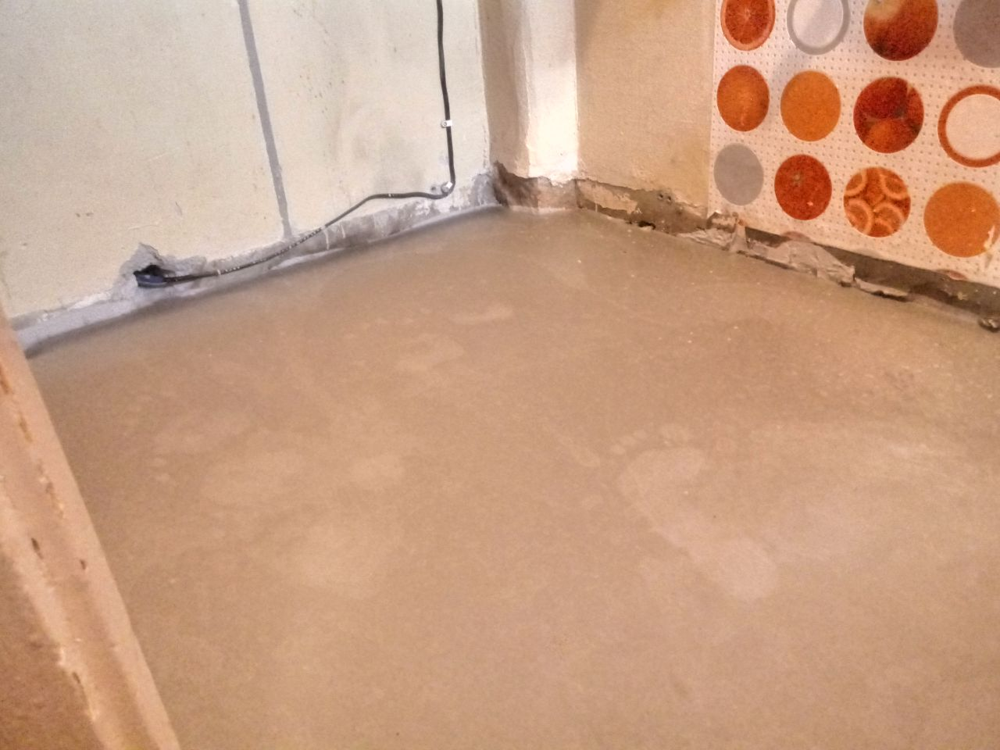
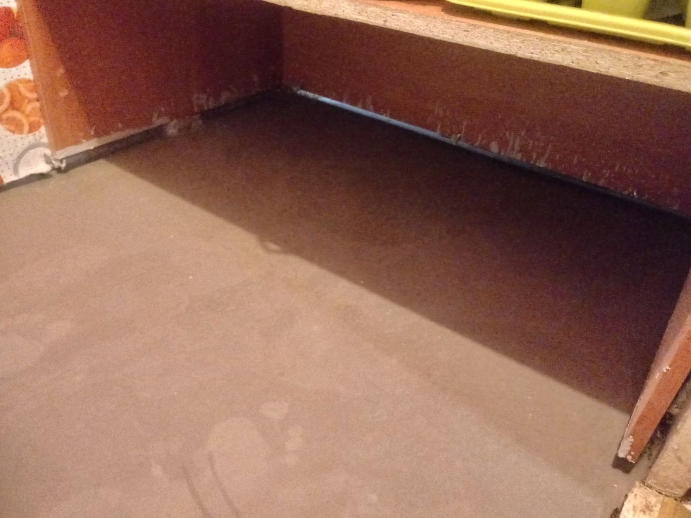
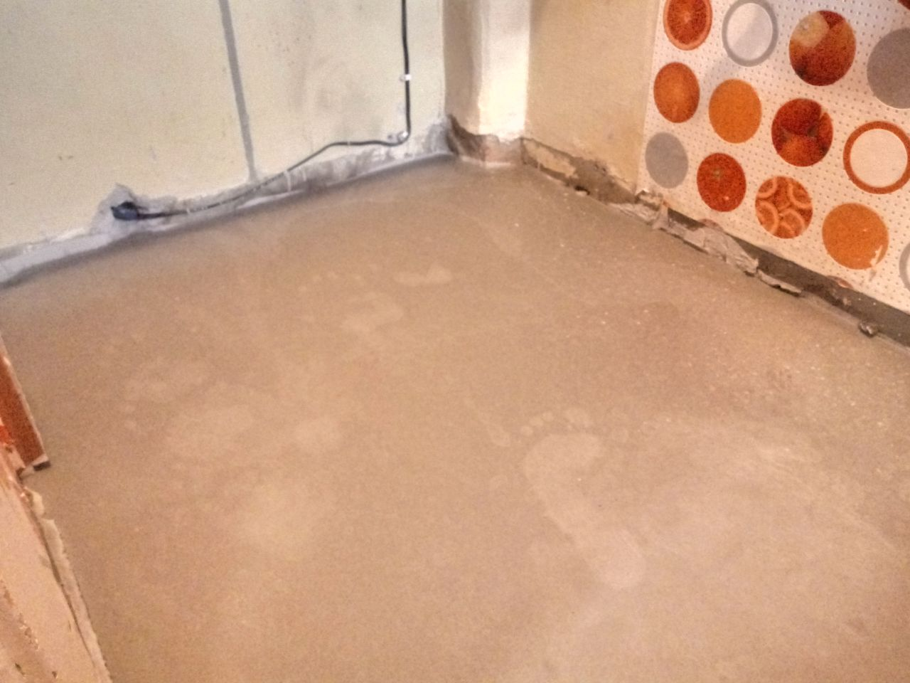

# Работа

**День первый**: Разобрали нижнюю чать стола, сняли дверцы, что бы был доступ к полу, cняли пол выгребли мусор и пыль, поехали в магазин всё купили и доставили домой, прошлись грунтовкой два раза.

На всё ушол день с перерывами на поесть.

*  
*  
*  
*  

**День второй**: Залили пол в два этапа. С начала залили 3 мешка, потом перерыв на подсыхание 2-а часа, потом залили ещё два, На работу в среднем ушло 5 часов.

**Выводы**: один мешок оказался лишним \(лучьше больше чем меньше\). Очень помогла плёнка, иначе бы всё загадили, а вод ведро на 20 л. на мешок в 25 кг прямо в притык. По заливки: думаю лучще был бы вариант, это мешать и заливать за раз мешок, так бы выходило быстрее и всю поверхность за раз накрывал новый слой. А так пришлось мешать по пол мешка.

*  
*  
*  
*  
*  

